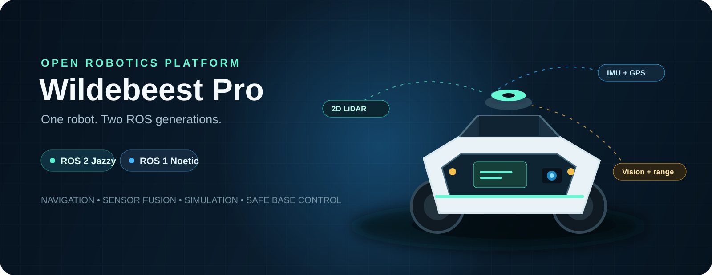
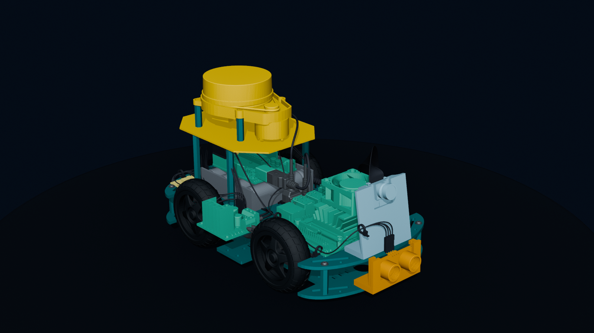
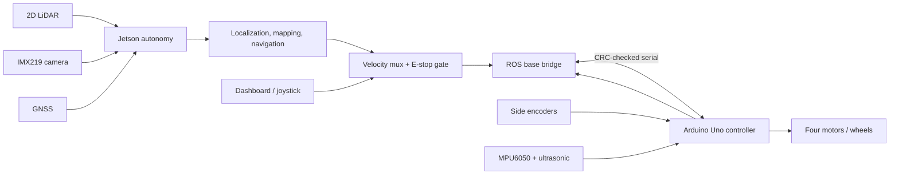

<p align="center">
  
</p>

<p align="center">
  <a href="https://github.com/Tech2morrow/Wildebeest_Pro/actions/workflows/ci.yml"></a>
  
  
  
  
  <a href="LICENSE"></a>
</p>

Wildebeest Pro is a complete reference implementation for a compact, four-wheel skid-steer autonomous robot. It combines an NVIDIA Jetson-class autonomy computer, an Arduino Uno safety-oriented base controller, LiDAR, camera, IMU, GNSS, ultrasonic ranging, reproducible simulation, and equivalent ROS 2 and ROS 1 interfaces.

> **Commissioning status:** the software, firmware, documentation, mock transports, and simulation models are implemented and host-tested. The physical robot has **not** been electrically or mechanically validated by this repository. Keep motor power disconnected until the BOM blockers, wiring checks, calibration, and staged acceptance tests are complete. This is not a safety-rated machine.



## What is included

| Area | ROS 2 Jazzy | ROS 1 Noetic | Shared contract |
|---|---:|---:|---|
| Four-wheel description, TF, RViz | Yes | Yes | CAD-derived `33.622 mm` wheel radius, `121.843 mm` track, `117.150 mm` wheelbase |
| Serial base bridge and deterministic mock | Yes | Yes | CRC-16 frames, exact firmware identity gate, 300 ms MCU watchdog |
| Velocity arbitration and E-stop latch | Yes | Yes | navigation, teleop, joystick, and dashboard inputs require fresh commands |
| Encoder/IMU fusion and GNSS option | Yes | Yes | `/wheel/odometry`, `/odometry/filtered`, REP-103/105 frames |
| Navigation and mapping | Nav2 / SLAM Toolbox | move_base / gmapping | common sensor and frame semantics |
| Physics simulation | Gazebo Harmonic | Gazebo Classic legacy | four driven wheels and timeout-protected commands |
| Operator dashboard | Browser | Browser | rosbridge UI with offline-safe controls and responsive layout |

The ROS 2 path is recommended for new work. ROS 1 Noetic is maintained here as a migration and legacy profile; upstream Noetic is end-of-life.

## Run the software-only robot on any development PC

The most reproducible path is Docker Desktop (Windows/macOS) or Docker Engine with Compose (Linux). Git LFS is only needed when you want the full mechanical corpus.

```bash
git clone https://github.com/Tech2morrow/Wildebeest_Pro.git
cd Wildebeest_Pro
git lfs install
git lfs pull
```

Start the recommended ROS 2 mock robot:

```bash
docker compose --profile ros2 up --build ros2-mock
```

Or start the ROS 1 compatibility profile:

```bash
docker compose --profile ros1 up --build ros1-mock
```

These commands run the complete graph with a deterministic software base, so no serial device or motor hardware is required. Stop with `Ctrl+C`.

### Native ROS 2 on Ubuntu 24.04

```bash
./scripts/bootstrap.sh ros2
./scripts/build.sh ros2
source ros2_ws/install/setup.bash
ros2 launch wildebeest_bringup robot.launch.py use_sim:=true
```

For Gazebo physics:

```bash
ros2 launch wildebeest_gz simulation.launch.py use_rviz:=true
```

### Native ROS 1 on Ubuntu 20.04

```bash
./scripts/bootstrap.sh ros1
./scripts/build.sh ros1
source ros1_ws/devel/setup.bash
roslaunch wildebeest_bringup robot.launch use_sim:=true
```

For the legacy Gazebo demo:

```bash
roslaunch wildebeest_simulation demo.launch
```

The original Jetson Nano software image is not a native ROS 2 Jazzy target. The handbook explains supported split-compute, container, replacement-SBC, and ROS 1 legacy options before you choose an image.

## Architecture



All command sources pass through arbitration. The base bridge will not move until it receives the exact firmware boot identity, an E-stop release cannot replay an old command, and both hardware and simulation paths stop on stale velocity input. See the [interface contract](docs/software/interfaces.md) and [serial protocol](docs/reference/serial-protocol.md).

### Sensor identification palette

The same high-contrast palette is applied to sensor visuals in ROS 1, ROS 2, RViz, Gazebo, and the CAD showcase. Colors identify hardware only; they never indicate live health or status.

| Sensor | Visual color | Hex |
|---|---|---|
| 2D LiDAR | Orange | `#E69F00` |
| MPU6050 IMU | Rose | `#CC79A7` |
| GNSS receiver | Yellow | `#F0E442` |
| IMX219 camera | Sky blue | `#56B4E9` |
| Front ultrasonic | Vermillion | `#D55E00` |

## Firmware, dashboard, and documentation

Build the Arduino Uno firmware with PlatformIO:

```bash
python -m pip install platformio
platformio run -d firmware/wildebeest_base
```

Run the local operator dashboard (Node.js 20+):

```bash
node dashboard/dev-server.mjs
```

Then open `http://127.0.0.1:8088/`. Live operation additionally requires a trusted rosbridge endpoint; the UI never bypasses the velocity multiplexer.

Build the handbook locally:

```bash
python -m pip install mkdocs-material
mkdocs serve -f docs/mkdocs.yml
```

Start with the [readiness guide](docs/getting-started.md), then follow [wiring](docs/hardware/wiring.md), [assembly](docs/hardware/assembly.md), [calibration](docs/calibration.md), and the [acceptance plan](docs/testing.md) in order. The spreadsheet [commissioning BOM](BOM/Wildebeest_Pro_BOM.xlsx) opens with a deliberate **BLOCKED** gate until safety-critical selections are verified.

## Mechanical design

The authoritative native model is [`Wildebeest_Pro_P&G.SLDASM`](<3D_Mechanical_Design/P&G Wildebeest_Pro/Wildebeest_Pro_P&G.SLDASM>). A matching `177 MB` AP203 [`Wildebeest_Pro_P&G.STEP`](<3D_Mechanical_Design/P&G Wildebeest_Pro/Wildebeest_Pro_P&G.STEP>) is available for CAD tools without SolidWorks. The requested `.asm` file does not exist; `.SLDASM` is the actual SolidWorks assembly.

The corpus also contains 595 placed component STL files. Read the [CAD guide](3D_Mechanical_Design/README.md) and [audited manifest](3D_Mechanical_Design/MANIFEST.md) before exporting ROS meshes: the raw files use millimetres, assembly coordinates, and more than 2.8 million triangles. The repository uses lightweight link-local primitives for portable runtime simulation and preserves the detailed sources through Git LFS.

Recreate the showcase image from the checked-in CAD exports with Blender 5.2+:

```bash
blender --background --python tools/render_cad.py -- --output assets/cad-render.png
```

## Repository map

| Path | Purpose |
|---|---|
| `ros2_ws/` | Primary Jazzy packages: base, bringup, description, Nav2, Gazebo |
| `ros1_ws/` | Noetic-compatible base, bringup, description, navigation, simulation |
| `firmware/wildebeest_base/` | Uno motor/encoder controller and fail-safe serial protocol |
| `config/robot.toml` | Version-neutral geometry, limits, serial, power, and topic defaults |
| `dashboard/` | Dependency-free mission-control web interface |
| `docs/` | MkDocs handbook, safety case, tests, operations, and troubleshooting |
| `BOM/` | Filterable commissioning workbook with cost formulas and release gate |
| `3D_Mechanical_Design/` | SolidWorks, STEP, STL, appearance, and CAD audit files |
| `tools/` | Protocol codec, mock MCU, preflight doctor, tests, and CAD renderer |

## Verify a checkout

On Windows:

```powershell
python -m pip install -r requirements-ci.txt
.\scripts\test.ps1
```

On Linux:

```bash
python3 -m pip install -r requirements-ci.txt
./scripts/test.sh
```

CI repeats protocol, dashboard, manifest, documentation, firmware, and container-build gates without downloading the 500+ MiB CAD corpus. Physical commissioning results must be recorded separately; a green software build is not evidence that an energized robot is safe.

## Contributing, credits, and licensing

Contributions are welcome through [the contributor guide](CONTRIBUTING.md). Security-sensitive reports follow [SECURITY.md](SECURITY.md).

Wildebeest Pro was created by Muhammed Nabeel. Thanks to Mr. Anouar Dhouibi for assistance with the original joystick teleoperation GUI concept, and to every open-source project on which this implementation builds.

Original project software and documentation are provided under the [MIT License](LICENSE). CAD and embedded vendor/reference assets may have separate or unconfirmed rights; inclusion does not relicense them. Review [THIRD_PARTY_NOTICES.md](THIRD_PARTY_NOTICES.md) before redistribution or commercial use.
