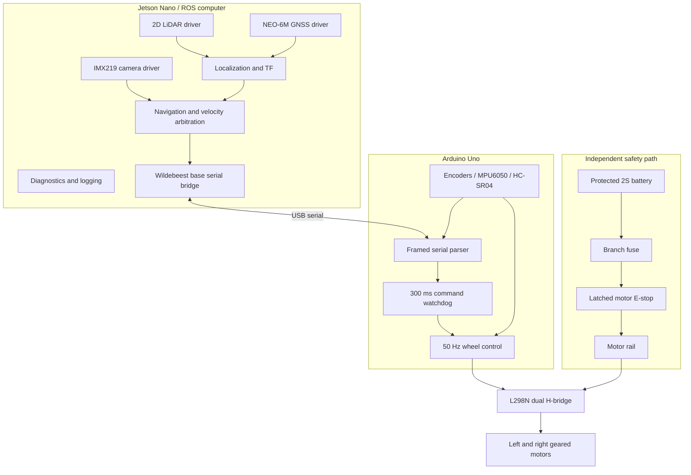
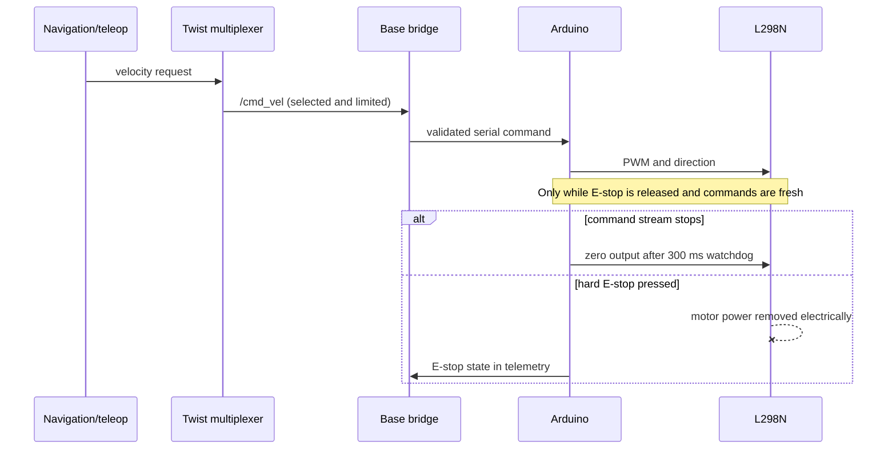
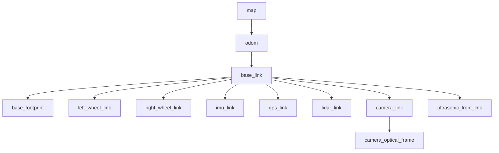

# System architecture

Wildebeest Pro uses a split-control architecture. Linux owns tasks that benefit from ROS and higher compute; the microcontroller owns bounded-latency I/O and the final software stop layer. The hard emergency stop remains electrical and independent of both.

## Functional layout

## Responsibility boundaries

| Layer | Owns | Must not own |
|---|---|---|
| Electrical safety | Fuse, battery protection, motor disconnect, correct rails, wiring protection | Dependence on a ROS message or Linux process |
| Arduino firmware | Motor pin state, encoder counts, command timeout, local E-stop input, bounded telemetry | Global planning, map state, or unbounded/blocking work in the control loop |
| Base bridge | Serial validation, unit conversion, device health, `/cmd_vel` to firmware commands, raw odometry publication | Autonomous decision-making or silently reusing stale telemetry |
| Velocity arbitration | Selects teleop/navigation/safety command source and enforces limits | Direct pin control |
| Localization | Fuses wheel odometry, IMU, and optionally GNSS; publishes a single authoritative transform | Sending motion commands |
| Navigation | Mapping/localization, costmaps, global/local planning, recoveries | Bypassing the velocity multiplexer or motor watchdog |
| Sensor drivers | Timestamped, framed sensor messages and diagnostics | Publishing transforms that contradict the robot description |

## Motion and stop chain

There are deliberately multiple stop mechanisms:

1. The navigation or operator publishes zero velocity.
2. The velocity multiplexer times out stale command sources.
3. The base bridge stops transmitting on invalid state or shutdown.
4. The Arduino stops output after 300 ms without a valid command.
5. The hard E-stop removes motor energy even if every processor is stuck.

Each layer is tested independently. None is a substitute for the layer below it.

## ROS package map

The same package roles exist in `ros1_ws/src` and `ros2_ws/src`. Build-system and launch syntax differ, but the public contract in [ROS interfaces](software/interfaces.md) does not.

| Package | Role | Hardware dependency |
|---|---|---|
| `wildebeest_description` | Xacro/URDF, meshes, joints, sensor frames, RViz configuration | None |
| `wildebeest_base` | Arduino serial bridge, odometry/joint state publication, simulated/mock base | USB serial for real mode |
| `wildebeest_bringup` | Composed launch, sensor drivers, state estimation, velocity arbitration, parameters | Model-specific drivers in real mode |
| `wildebeest_navigation` | SLAM/localization and autonomous navigation configuration | `/scan`, TF, odometry; GNSS only for outdoor extensions |
| `wildebeest_gz` (ROS 2) | Gazebo Sim world, spawn and simulated sensors/control hooks | None |
| `wildebeest_simulation` (ROS 1) | Gazebo Classic world, control/sensor hooks and navigation demo | None |

The description is not generated from the SolidWorks assembly. Its inertias, collision geometry, origins, and joint axes must be independently reviewed against the constructed robot.

## Coordinate-frame contract

Frame names follow REP-105 conventions:

- `map -> odom` is owned by localization/SLAM when enabled.
- `odom -> base_link` is owned by exactly one odometry/localization component.
- `base_link -> base_footprint` is a fixed convenience transform to the ground-projected frame; sensor extrinsics are also supplied by `robot_state_publisher` from the URDF.
- Camera optical axes follow the ROS optical-frame convention; do not reuse `camera_link` as the optical frame.
- Wheel joints are published through `/joint_states`; no second node may publish the same joints.

Run a TF audit whenever launch composition changes. Duplicate transform publishers can look plausible in RViz while corrupting navigation.

## Localization modes

| Mode | World transform | Inputs | Intended environment |
|---|---|---|---|
| Wheel-only bench | none or fixed | Encoders | Lifted-wheel and short motion tests |
| Indoor local odometry | `odom -> base_link` | Encoders + IMU rate/acceleration | Teleoperation and local control |
| Indoor mapped navigation | `map -> odom` plus local odometry | LiDAR + encoders + IMU | Structured indoor spaces |
| Outdoor georeferenced extension | map/geodetic alignment plus local odometry | Encoders + IMU + GNSS; LiDAR as applicable | Open sky after GNSS validation |

The MPU6050 has no magnetometer, and a NEO-6M position fix does not provide reliable stationary heading. Absolute yaw therefore requires motion-derived GNSS course, scan matching, an added heading sensor, or another validated source. Do not configure an estimator as though the IMU supplies absolute magnetic heading.

## Timing and units

- ROS-facing values use SI units: metres, radians, seconds, metres per second, and radians per second.
- The firmware control loop target is 50 Hz.
- Default telemetry targets are odometry 20 Hz, optional IMU 50 Hz, and range 10 Hz.
- Host and MCU sequence/timestamp behavior is defined in the [serial protocol](reference/serial-protocol.md).
- Sensor timestamps should represent acquisition time where the driver exposes it, not merely callback time.
- The Jetson and any remote workstation need synchronized clocks for distributed ROS; record the time-sync method and measured offset.

Rates are budgets, not guarantees. Acceptance testing records observed rate, jitter, dropouts, CPU load, and temperature on the final image.

## Degraded behavior

| Failure | Required behavior |
|---|---|
| ROS process crash or USB disconnect | Arduino watchdog commands zero motor output |
| Invalid/corrupt serial frame | Discard frame, increment diagnostics; never reinterpret it as motion |
| Encoder loss | Stop autonomous motion; do not continue open-loop unless explicitly in a restrained test mode |
| IMU loss | Report degraded localization; use only a separately validated fallback |
| LiDAR loss/stale scan | Navigation stops; teleoperation, if allowed, remains low-speed and directly supervised |
| GNSS loss | Outdoor global objective pauses; local obstacle stop behavior remains available |
| Camera loss | Vision-dependent behaviors stop; base safety path remains unaffected |
| Low battery or regulator brownout | Command stop, log event, and shut down cleanly; hardware protection is the final backstop |
| Jetson thermal throttling | Abort autonomy if control deadlines or perception freshness cannot be maintained |

These responses are design requirements. Mark each as verified only after the corresponding fault-injection test passes.

## Compute-platform limitation

The Jetson Nano and its JetPack 4 software stack are legacy constraints. The maintained ROS 2 workspace targets Jazzy/Ubuntu 24.04, which is suitable for a supported workstation or capable 24.04 arm64 SBC but not a stock Nano image. Three honest choices exist: keep the Nano as a vendor-driver sensor computer in a validated split deployment, undertake an experimental community/container/source port and own all evidence, or revise the compute hardware. A replacement SBC is a hardware revision: power, CSI camera, device paths, cooling, performance, mounts, EMC and safety tests all repeat.
