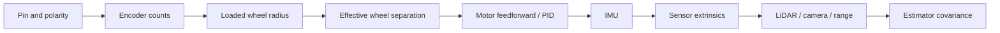

# Calibration

Calibration converts the assembled robot—not catalogue values—into software parameters. Work on a stand first, use low limits, save raw data, and record environmental conditions and firmware/software revisions.

## Calibration order



Changing a wheel, tire pressure/material, gearbox, encoder decode mode, motor driver, IMU mount, or sensor bracket invalidates downstream calibration.

## 1. Direction and sign matrix

Lift all four wheels and cap PWM to the commissioning limit.

| Test | Required observation |
|---|---|
| Positive left-side command | Both left wheels drive forward together; left-side encoder position increases |
| Positive right-side command | Both right wheels drive forward together; right-side encoder position increases |
| Positive `linear.x` | All four wheels drive forward; both measured side velocities are positive |
| Positive `angular.z` | Robot convention is counter-clockwise viewed from above; right-side pair drives forward relative to the left |
| E-stop asserted | Both side outputs and all four motors are de-energized; status reports asserted |
| Command source removed | Both outputs reach zero within the validated 300 ms firmware watchdog bound plus measured actuation delay |

Correct wiring/polarity or explicit per-side sign parameters. Do not scatter minus signs among firmware, URDF, bridge, and estimator until a plot looks right.

## 2. Encoder counts per output revolution

“Pulses per revolution” may refer to one channel's cycles at the motor shaft, edges after quadrature decoding, or counts after the gearbox. Determine what the firmware reports.

1. Mark wheel and chassis at one angular reference.
2. Zero the count with motor power disabled.
3. Rotate the output wheel slowly for `N` complete revolutions in the positive direction.
4. Record total signed counts, repeat in the negative direction, and perform at least three trials.
5. Compute:

```text
counts_per_output_revolution = abs(total_counts) / N
radians_per_count            = 2*pi / counts_per_output_revolution
```

Use enough revolutions to expose missed edges and gear backlash. Repeat at increasing safe speeds with a logic analyzer or external revolution reference. The repository value `600` is only a commissioning placeholder.

## 3. Loaded wheel radius

Measure effective rolling radius on the floor under normal mass, not just unloaded wheel diameter.

1. Mark a straight course substantially longer than one wheel circumference.
2. Place all four wheels at repeatable starting marks and record both side-encoder counts.
3. Move slowly in a straight line without wheel slip; record actual tape-measured distance and count change per wheel.
4. Repeat forward/backward and in both course directions.
5. Estimate each side:

```text
distance_per_count = measured_distance / encoder_count_change
effective_radius   = distance_per_count * counts_per_revolution / (2*pi)
```

Investigate left/right differences before hiding them in multipliers: wheel wear, mounting eccentricity, load distribution, missed counts, or floor slip may be the real issue.

## 4. Effective wheel separation

The kinematic separation is tuned from motion and may differ from a caliper measurement because of tire scrub.

1. Start with the measured distance between left and right effective contact paths.
2. Command slow in-place rotations on the intended floor surface.
3. Measure actual yaw with an independent reference over multiple complete rotations in both directions.
4. Adjust the separation/multiplier using the ratio between measured and odometric yaw.
5. Validate on arcs as well as pivots.

For ideal differential-drive increments:

```text
delta_s     = (delta_right + delta_left) / 2
delta_theta = (delta_right - delta_left) / wheel_separation
```

Report repeatability and floor type. Do not tune geometry to compensate for a reversed encoder, saturated motor, loose wheel, or timing bug.

## 5. Motor response and closed-loop tuning

Characterize each side separately with the chassis lifted, then under controlled load:

- deadband and minimum repeatable speed;
- steady wheel speed versus PWM in both directions;
- startup overshoot and stop behavior;
- left/right asymmetry;
- battery-voltage dependence;
- driver/motor temperature and current;
- encoder noise and control-loop jitter.

Start with feedforward, then add feedback gains gradually. Limit integral accumulation and reset it when stopped/E-stopped. Validate step, ramp, reversal, and disturbance response. Acceptance bounds for speed error, overshoot, settling, current, and temperature remain `TBD` until component and operational requirements are documented.

## 6. MPU6050

### Mount and axis check

Document the transform from the breakout's printed/verified axes to `imu_link` and from `imu_link` to `base_link`. With the robot stationary and level, the gravity vector magnitude should be plausible and rotate into the expected axis when the chassis is placed on known faces. Rotate about one chassis axis at a time and check gyroscope sign.

### Bias and noise

1. Warm the complete robot to a representative state with motors disabled.
2. Keep it motionless on a rigid surface.
3. Record a long stationary dataset at the configured 50 Hz target.
4. Estimate mean gyro bias, accelerometer offsets, standard deviation, drift, and temperature dependence.
5. Repeat with compute load and motor operation (wheels lifted) to identify vibration/EMI effects.

The MPU6050 has no magnetometer. Do not publish a trusted absolute yaw merely by integrating its gyro; yaw will drift. If firmware emits raw data only, set the ROS IMU orientation covariance convention accordingly.

## 7. LiDAR

- Confirm the exact model and manufacturer driver.
- Place flat targets at independently measured distances and bearings.
- Verify `angle_min`, `angle_max`, increment direction, zero-bearing direction, scan time, range clipping, invalid-return encoding, and timestamp age.
- Measure the rigid transform from `base_link` to `lidar_link`.
- Check for chassis/mast returns and decide whether physical relocation or a documented filter is appropriate.
- Run with motors and regulators active to expose power/EMI issues.

Never erase real obstacles with a broad software mask just to produce a clean map.

## 8. Camera

Calibrate the exact camera, lens, focus, resolution, and crop used at runtime. A calibration for another IMX219 module or video mode is invalid.

Typical ROS calibration tooling uses a known checkerboard or ChArUco target. Measure square size with an appropriate instrument, fill the image with diverse target positions/angles, reject blurred samples, and save:

- image width/height and pixel format;
- intrinsic matrix and distortion model/coefficients;
- reprojection-error evidence;
- camera name and calibration date;
- `camera_link -> camera_optical_frame` convention;
- file path/checksum tied to the robot serial number.

Validate by rectifying new images and inspecting straight lines across the full field.

## 9. Ultrasonic range

Against targets with varied material, size, angle, and distance, characterize:

- minimum reliable range and saturation behavior;
- maximum useful range in the operating environment;
- offset from sensor face to reported range;
- field of view/side lobes;
- no-return/timeout representation;
- repeatability and temperature sensitivity;
- crosstalk if more than one module is installed.

Set `sensor_msgs/Range` min/max/field-of-view from this evidence. Treat out-of-range and missing echoes as unknown, not automatically clear.

## 10. GNSS

Test outdoors with an unobstructed sky view:

- cold and warm time to valid fix;
- fix status and satellite/quality indicators exposed by the driver;
- stationary scatter over time;
- repeatability at surveyed or independently known points;
- update rate and serial dropouts;
- behavior near buildings, vehicles, trees, and active electronics.

GNSS position alone does not supply reliable stationary heading. If course over ground is used, determine the minimum speed and quality threshold experimentally and reject it below that condition. Never navigate in latitude/longitude degrees as though they are local metres; use a validated local tangent/UTM transform and datum policy.

## 11. Extrinsics and time

Measure each sensor origin and orientation in a documented chassis coordinate system. Use metres and radians in configuration. Photograph measurement references. Validate transforms in RViz with live data and known targets.

For each data stream, measure:

- observed rate and jitter;
- transport latency and timestamp age;
- clock domain and synchronization method;
- behavior after disconnect/reconnect;
- timestamp monotonicity across MCU resets.

Time errors can masquerade as spatial calibration errors while the robot is moving.

## 12. Covariance and estimator validation

Covariance expresses observed uncertainty. Derive initial values from stationary/no-motion data and repeated known trajectories, then validate innovations and residuals. Never use zero covariance to mean “unknown”; ROS messages define specific unknown conventions, and an estimator may interpret zero as impossible precision.

Run at least:

- straight, reverse, pivot, circle, and figure-eight paths;
- stationary drift tests before and after warm-up;
- wheel-slip and mild obstruction tests under supervision;
- LiDAR-degraded and GNSS-degraded datasets;
- rosbag replay with identical configuration.

Store the raw bag, ground-truth method, parameter file, plots, result summary, and commit ID. A tuned parameter without provenance is not a calibration artifact.
