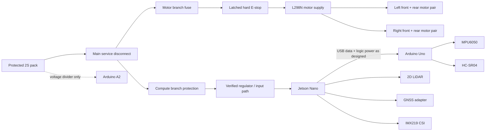

# Wiring and pinout

This chapter defines the reference harness for the repository firmware. It is not evidence that the original CAD wiring is correct. Module variants differ; verify labels against schematics and measurements at the connector in hand.

!!! danger "Verify before every first power-up"
    Disconnect the battery and USB. Remove the motor-supply fuse. Check every conductor end-to-end, verify there are no shorts between power and ground, set each regulator with its load disconnected, and confirm polarity at the destination connector. First energize each rail from a current-limited bench supply. Stop immediately on unexpected current, heat, odor, sound, or voltage.

## Reference power topology

Use a two-contact, mechanically linked E-stop arrangement:

1. A suitably rated normally-closed main contact is in series with the motor-power path. Healthy/released is closed; pressing the E-stop opens the contact and removes L298N motor energy.
2. A separate, isolated normally-closed auxiliary contact connects Arduino A1 to Arduino ground. Healthy/released reads `LOW`; pressing, unplugging, or breaking the sense wire opens the loop, the Uno's `INPUT_PULLUP` makes A1 `HIGH`, and firmware reports hard E-stop asserted.

The auxiliary circuit reports status only. **Never route motor current into A1, Arduino ground traces, or through an Arduino board.** Verify the selected E-stop's DC contact ratings, positive-opening behavior where required, contact isolation, and mechanical linkage from its actual datasheet.

The exact Jetson power path depends on its carrier revision. Use only the carrier manufacturer's documented input and settings. Do not back-power the Jetson through a GPIO header, CSI connector, Arduino USB path, or sensor pin.

## Arduino reference pin map

These are the repository firmware defaults and can be overridden in `Config.h`. Any override must be changed in the wiring record, firmware build metadata, and acceptance evidence together.

| Arduino pin | Firmware signal | Connects to | Direction at Arduino | Commissioning note |
|---|---|---|---|---|
| D2 | Left encoder A | Left encoder channel A | input | Interrupt-capable on Uno; verify pull-up/output type |
| D4 | Left encoder B | Left encoder channel B | input | Verify A/B phase and sign |
| D3 | Right encoder A | Right encoder channel A | input | Interrupt-capable on Uno; verify max edge rate |
| D12 | Right encoder B | Right encoder channel B | input | Verify A/B phase and sign |
| D5 | L298N ENA | Left-pair channel enable/PWM | output | PWM; remove/handle board enable jumper as its schematic requires |
| D7 | L298N IN1 | Left-channel direction input 1 | output | Motor polarity is calibrated with wheels lifted |
| D8 | L298N IN2 | Left-channel direction input 2 | output | Must boot to disabled/zero state |
| D6 | L298N ENB | Right-pair channel enable/PWM | output | PWM; remove/handle board enable jumper as its schematic requires |
| D9 | L298N IN3 | Right-channel direction input 1 | output | Motor polarity is calibrated with wheels lifted |
| D10 | L298N IN4 | Right-channel direction input 2 | output | Must boot to disabled/zero state |
| D11 | Ultrasonic trigger | Front HC-SR04 TRIG | output | Trigger schedule must prevent crosstalk |
| A0 | Ultrasonic echo | Front HC-SR04 ECHO | input | Reference connection is to 5 V Uno, **not** Jetson GPIO |
| A1 | Hard E-stop sense | NC auxiliary contact to Arduino GND | input with internal pull-up; `LOW` healthy, `HIGH` asserted/open-wire | Status only; main NC contact separately interrupts motor energy |
| A2 | Battery sense | Engineered resistor divider/filter | analog input | Never connect pack voltage directly; verify worst-case pin voltage |
| A4 | I²C SDA | MPU6050 SDA | bidirectional | Verify breakout pull-up voltage |
| A5 | I²C SCL | MPU6050 SCL | output/bidirectional | Verify address and bus integrity |
| USB serial | Base link | Jetson USB | bidirectional | 115200 baud, 8-N-1 |

Pins D0/D1 remain unused by the reference harness so USB serial is not electrically contended.

## Jetson connection map

| Device | Preferred interface | Verify before connection |
|---|---|---|
| Arduino | USB | Cable is data-capable; stable `/dev/serial/by-id/...` path; USB power interaction documented |
| 2D LiDAR | Model-specific USB/serial | Exact supply source/current, logic level, USB identity, driver and permissions |
| NEO-6M | Verified USB-to-UART adapter or documented carrier UART | GNSS breakout supply and UART logic level; RX/TX crossed correctly; shared ground |
| IMX219 | CSI ribbon | Jetson powered off; connector unlocked/locked correctly; contact orientation and lane compatibility |

Jetson GPIO is 3.3 V logic and is not 5 V tolerant. No HC-SR04 echo, Arduino output, or unspecified breakout signal may be connected directly to it. Use a correctly designed level translator where a direct GPIO/UART/I²C connection is deliberately engineered.

## L298N terminal checklist

Labels and jumpers vary among L298N boards. Identify from the actual module schematic:

- motor-supply input and return;
- logic-supply input/output behavior;
- whether a regulator-enable jumper makes a pin an output rather than an input;
- ENA/ENB jumper behavior;
- OUT1/OUT2 and OUT3/OUT4 motor pairs;
- the board's thermal/current limits and any onboard protection.

!!! warning "Never tie power outputs together"
    Do not connect an L298N module's onboard-regulator output to a Jetson/Arduino 5 V rail or another regulator output unless the power architecture explicitly proves safe current sharing/backfeed behavior. Usually the correct action is to use one documented logic source and configure the module jumper accordingly.

The motor supply and logic ground need a defined common reference unless a deliberately isolated interface is used. Route high motor current directly back to the power distribution point, not through an Arduino, Jetson, USB shield, breadboard, or encoder ground wire.

The four-wheel chassis pairs its front and rear motors by side. Do not connect a
pair until individual polarity is matched and the channel, connector, wire,
fuse, and supply have margin above the pair's measured worst-case current. The
reference L298N is a commissioning blocker if that margin cannot be proved.

## Encoder and motor harness

For each side:

1. Identify motor terminals independently from encoder power and outputs.
2. Verify encoder supply and output voltage with the motor disconnected.
3. Determine whether outputs are push-pull, open-collector/open-drain, or mechanical contacts.
4. Select pull-ups and filtering appropriate to that output; do not assume Arduino internal pull-ups are sufficient.
5. Twist motor leads together. Route encoder power/signals separately from motor and PWM wiring.
6. Add strain relief at the motor, chassis transition, and controller.
7. With wheels lifted and motor supply current-limited, establish the direction/encoder sign matrix in [calibration](../calibration.md).

KY-040-style hand-rotary modules are often mechanically and electrically different from motor-shaft encoders. Confirm that the installed sensors can sustain the shaft speed and environment; the CAD label does not establish suitability.

## MPU6050 wiring

The reference path is Arduino I²C on A4/A5. Before connecting:

- identify breakout `VCC`, `GND`, `SDA`, `SCL`, address select, and any interrupt pin;
- determine whether the breakout contains a regulator and level shifters;
- measure the idle SDA/SCL high level;
- ensure no pull-up drives a device beyond its I/O limit;
- mount rigidly with axes documented relative to `base_link`.

Keep I²C short and away from motor leads. If errors appear only under motor load, investigate grounding, EMI, pull-ups, and physical routing rather than masking the issue with retries.

## HC-SR04 wiring

The reference front sensor uses D11 for trigger and A0 for echo on the 5 V Arduino. Record the actual module supply and characterize its valid range and beam. A timeout is a missing measurement, not a maximum-range obstacle-free result.

For multiple modules:

- allocate a unique echo input per sensor;
- trigger sequentially with enough quiet time for the environment;
- reject late echoes from the previous sensor;
- angle and separate modules to limit acoustic coupling;
- expose each as its own `sensor_msgs/Range` frame/topic;
- verify behavior against soft, angled, narrow, and cross-talking targets.

## Battery measurement input

Arduino A2 is reserved for a resistor divider/filter, but the divider values are intentionally unspecified. Design it from:

- the maximum credible pack voltage, including charger/fault cases;
- Arduino ADC absolute and recommended input limits;
- resistor tolerance and ADC source-impedance guidance;
- expected noise and filter settling;
- acceptable standby drain;
- calibration against a traceable meter.

Add an analysis showing that the worst tolerance stack remains within the pin limit. Firmware scaling without a safe physical divider does nothing to protect the input.

## Harness verification record

Complete and retain this table for every hardware revision:

| Check | Battery disconnected | Bench supply current limit | Battery power | Evidence |
|---|:---:|:---:|:---:|---|
| Pack connector polarity and keying | required | n/a | required | photo + meter reading |
| No power-to-ground short on each rail | required | required | required | resistance/current log |
| Regulator no-load output | required setup | required | optional | meter reading |
| Regulator loaded output and ripple | n/a | required | required | scope/log |
| E-stop removes motor rail | continuity | required | required | measurement/video |
| E-stop sense: released=`LOW`, pressed/open-wire=`HIGH` | continuity | required | required | logic reading |
| Motor current avoids logic harness | visual | required | required | annotated harness photo |
| Battery divider worst-case safe | analysis | required | required | calculation + ADC/meter log |
| USB/logic backfeed absent or controlled | continuity | required | required | power-state matrix |

Test the power-state matrix with Jetson off/on, USB unplugged/plugged, motor rail off/on, and charger disconnected/connected only where the pack manufacturer permits charging in-system. No state may energize a supposedly isolated rail through a signal cable.
