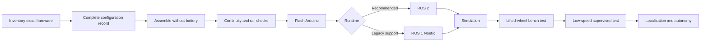

# Wildebeest Pro

Wildebeest Pro is an open, four-wheel skid-steer robotics platform built around a Jetson Nano and an Arduino Uno. Two wheels on each side share one differential-drive command, while the Jetson runs perception, localization, planning, and the ROS graph. The Arduino owns time-critical encoder sampling, motor output, range acquisition, and the motion watchdog. The design accommodates a 2D LiDAR, IMX219 CSI camera, MPU6050 IMU, NEO-6M GNSS receiver, wheel encoders, and HC-SR04 ultrasonic ranging.

This handbook turns the original mechanical concept into a reproducible integration target for both ROS 1 and ROS 2. It is written for builders who intend to measure their own hardware, preserve safety controls outside Linux, and prove each subsystem before attempting autonomous motion.

!!! danger "Prototype, not a safety-rated machine"
    The repository is not evidence of electrical certification, functional-safety certification, or safe operation around people. CAD filenames show design intent only. A competent builder must validate the exact modules, wiring, protection devices, structural parts, software revision, and operating environment. Keep the robot lifted or mechanically restrained until the staged acceptance plan authorizes floor testing.

## What is implemented

The intended repository layout is one hardware contract with two ROS integrations:

| Area | Purpose | Evidence level |
|---|---|---|
| `firmware/wildebeest_base` | Arduino motor, encoder, watchdog, optional IMU/range bridge | Bench verification required on the final harness |
| `ros2_ws/src` | ROS 2 base, description, bringup, navigation, and simulation packages | Build/static tests plus simulation where available |
| `ros1_ws/src` | ROS 1 equivalents using the same topics, frames, and serial protocol | Build/static tests plus simulation where available |
| `3D_Mechanical_Design` | Original SolidWorks/STEP design assets | Mechanical concept; dimensions and fit must be checked |
| `docs` | This integration, safety, calibration, and operations handbook | Normative project guidance |

Passing a software build does **not** mean a physical robot is safe or calibrated.

## Choose a path



New builders should follow this order:

1. Read [readiness and compatibility](getting-started.md) and the [safety case](safety.md).
2. Reconcile the [bill of materials](hardware/bom.md) and [hardware limitations](hardware/limitations.md) against the actual parts in hand.
3. Record every TBD in the [configuration record](reference/configuration-record.md).
4. Build using the [wiring](hardware/wiring.md) and [assembly](hardware/assembly.md) gates.
5. Calibrate every measurement in [calibration](calibration.md).
6. Build [ROS 2](software/ros2.md) or [ROS 1](software/ros1.md), then prove behavior in [simulation](software/simulation.md).
7. Execute the [test and acceptance plan](testing.md) before autonomous operation.

## Design principles

- **Power safety is physical.** The emergency stop must remove motor energy independently of ROS, USB, and the Jetson.
- **A stopped command is the default.** The Arduino starts disabled and stops the motors when its 300 ms command watchdog expires.
- **One contract, two ROS versions.** Topic semantics, frame names, SI units, and the serial protocol remain equivalent across ROS 1 and ROS 2.
- **Measured configuration beats nominal configuration.** Wheel radius, track width, counts per revolution, voltage thresholds, sensor transforms, and direction signs come from the finished robot.
- **Simulation precedes floor motion.** Launch, TF, velocity arbitration, localization, and navigation are exercised without energized motors first.
- **Diagnostics are part of control.** Stale data, reset counters, invalid packets, estimator disagreement, undervoltage, and lost transforms are operating conditions—not cosmetic warnings.

## Support status

ROS 2 is the primary path for new development. ROS 1 Noetic support exists for migration and legacy deployments, but Noetic reached end of life on 31 May 2025 and no longer receives official fixes or security updates. See [readiness and compatibility](getting-started.md) before choosing an operating-system image.

## How to read command examples

Commands assume the repository root is the current directory. Shell placeholders use angle brackets, for example `<serial-device>`; replace them and remove the brackets. Never paste a command that changes device permissions or motor state until you understand its scope.

The shortest software-only smoke test is:

=== "ROS 2"

    ```bash
    ./scripts/bootstrap.sh ros2
    ./scripts/build.sh ros2
    source ros2_ws/install/setup.bash
    ros2 launch wildebeest_bringup robot.launch.py use_sim:=true
    ```

=== "ROS 1"

    ```bash
    ./scripts/bootstrap.sh ros1
    ./scripts/build.sh ros1
    source ros1_ws/devel/setup.bash
    roslaunch wildebeest_bringup robot.launch use_sim:=true
    ```

If a referenced package or launch argument is absent in the checked-out revision, treat that as an implementation gap and open an issue with the commit ID and command output; do not improvise a hardware workaround.
