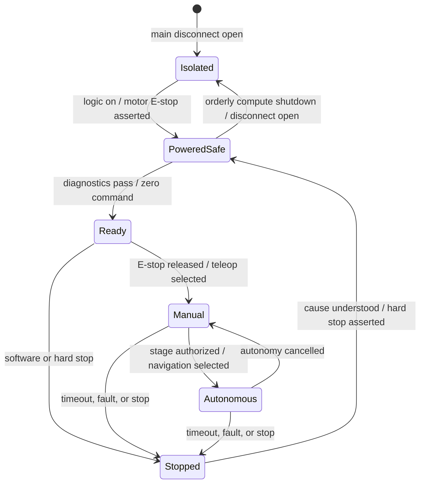

# Operations runbook

This runbook governs supervised prototype operation. Tailor it only through a reviewed configuration record and risk assessment. Autonomous operation around uninvolved people, public roads, drop-offs, traffic, animals, stairs, water, flammable material, or an uncontrolled radio network is outside the baseline scope.

## Roles and test area

For first motion and autonomous tests, use at least:

- **operator** — controls software and commands;
- **safety observer** — watches the robot and owns immediate access to the hard E-stop; not occupied with a laptop;
- **test lead** — may be one of the above only after the procedure is mature; authorizes stage and records result.

Mark a controlled exclusion zone, remove trip hazards, block stairs/drop-offs physically, provide a clear run-off area, and keep bystanders outside. Establish the spoken stop word and who may reset the E-stop.

## Operating states



There is no transition directly from fault to motion. Diagnose, document, return to a safe state, and repeat the affected checklist.

## Before every run

### Physical

- [ ] Authorized test stage, area, surface, slope, payload and weather confirmed
- [ ] Chassis, all four wheels/motors, sensors, battery and fastener retention inspected
- [ ] No pinched, abraded, loose or hot/discolored wiring; terminals guarded
- [ ] Cooling path clear; fan rotates freely; sensor apertures clean
- [ ] Battery undamaged, within approved state/temperature envelope, secured and disconnected from charger
- [ ] Main fuse correct and intact; no bypass wire or oversize substitute
- [ ] Main disconnect and hard E-stop operate mechanically
- [ ] E-stop main contact interrupts motor branch; auxiliary loop reports released `LOW`, pressed/open-wire `HIGH`
- [ ] Safety observer positioned with direct E-stop access

### Software/configuration

- [ ] Robot ID, commit, firmware build and parameter set match the approved record
- [ ] Correct ROS domain/master and time source; no unknown graph participants
- [ ] Real versus mock/simulation mode explicitly confirmed
- [ ] Unique `/cmd_vel`, `map -> odom`, and `odom -> base_link` ownership
- [ ] Calibrated geometry, limits, footprint and sensor transforms loaded
- [ ] Sufficient disk space for logs; privacy scope agreed
- [ ] All required diagnostics healthy or an approved degraded-mode procedure applies

## Startup

1. Press/latch the hard E-stop and keep command input neutral.
2. Open the main motor path. Connect the approved battery only if the harness inspection passes.
3. Energize the logic/compute path according to the released power sequence.
4. Wait for the Jetson/sensor computer to boot; confirm no motor energy is present.
5. Check system identity, storage, clock, temperature and devices:

    ```bash
    date --iso-8601=seconds
    df -h
    ls -l /dev/serial/by-id/
    python3 tools/robot_doctor.py
    ```

6. Start the selected ROS environment.

    === "ROS 2"

        ```bash
        source /opt/ros/jazzy/setup.bash
        source ros2_ws/install/setup.bash
        ros2 launch wildebeest_bringup robot.launch.py \
          use_sim:=false transport:=serial serial_port:=/dev/wildebeest-base
        ```

    === "ROS 1"

        ```bash
        source /opt/ros/noetic/setup.bash
        source ros1_ws/devel/setup.bash
        roslaunch wildebeest_bringup robot.launch \
          use_sim:=false base_port:=/dev/wildebeest-base sensors:=false joystick:=false
        ```

7. Confirm firmware boot/protocol, watchdog-stopped state, fresh odometry/required sensors, TF ownership and diagnostics.
8. Start logging. State aloud that the motor branch is about to be enabled.
9. Energize the motor branch while the hard E-stop remains pressed; verify the driver output is inactive.
10. With command still zero and observer ready, release the hard E-stop. Confirm the A1 status becomes healthy and no wheel moves.
11. Clear the software stop deliberately if engaged. Reconfirm zero command.
12. Enter the authorized test mode at the lowest validated limits.

Any unexpected movement returns immediately to hard-stop and isolated states.

## Manual motion checkout

Before autonomy, perform brief supervised commands:

1. zero command and command-source timeout;
2. forward and reverse;
3. counter-clockwise and clockwise rotation;
4. left/right arcs;
5. release of the teleop control (dead-man behavior where provided);
6. software stop;
7. hard stop at low speed;
8. recovery requiring deliberate clear and fresh command.

Compare wheel signs, odometry, TF, IMU yaw rate and visible motion. Abort on disagreement.

## Mapping

Use teleoperation and reduced limits. Start with a clean, static indoor environment and known loop closures.

```bash
# ROS 2
ros2 launch wildebeest_navigation navigation.launch.py slam:=true

# ROS 1
roslaunch wildebeest_navigation mapping.launch
```

Drive slowly with overlap and avoid moving objects where practical. Save the map with a unique environment/date/revision, inspect occupancy and scale, and record its origin. A blank/example map shipped with the repository is never an operational map.

## Localized navigation

Before setting a goal:

- load the reviewed map;
- set/verify the initial pose;
- compare LiDAR returns to mapped walls;
- check covariance converges plausibly;
- verify footprint and costmaps around the stationary robot;
- confirm recovery behaviors cannot cross physical hazards;
- confirm command source priority and stop path.

Start with one short goal inside the exclusion zone. The observer tracks the robot, not RViz. Pause after every anomaly instead of repeatedly commanding recovery.

## Outdoor/GNSS extension

Outdoor operation is not enabled merely by receiving `/gps/fix`. Require:

- declared outdoor environmental envelope and physical containment;
- valid datum/local projection policy;
- verified heading source and low-speed behavior;
- GNSS quality/covariance gates and multipath tests;
- local obstacle sensing independent of GNSS;
- loss-of-fix behavior and geofence validated without relying solely on software;
- legal/site authorization.

The NEO-6M is not a safety-rated geofence or collision-avoidance sensor.

## Logging

At minimum capture commands before/after arbitration, odometry, joint states, TF, diagnostics and sensors relevant to the test. Log configuration/commit/firmware identity alongside the bag.

Camera and GNSS can contain faces, license plates, interiors and precise location. Minimize collection, restrict access, define retention, and remove sensitive data before sharing. Never record secrets.

Monitor disk usage and write rate. A full disk or overloaded storage can destabilize the robot; logging must not be allowed to starve control.

## Normal shutdown

1. Cancel navigation/teleop and publish/confirm zero command.
2. Engage software stop.
3. Press the hard E-stop and verify motor power is removed.
4. Stop recording and save the run metadata/result.
5. Stop ROS processes; verify no background driver remains.
6. Shut down the Jetson/compute OS cleanly and wait for its documented power-off indication.
7. Open the main service disconnect and disconnect the battery if the design calls for it.
8. Inspect for heat, odor, loose parts, damage and abnormal battery condition.
9. Quarantine/label faults and update the maintenance log.

Do not remove Jetson power while storage is being written except when needed to prevent a greater hazard.

## Emergency response

### Unexpected motion or loss of control

1. Press the hard E-stop—do not troubleshoot through the terminal first.
2. Keep people clear until wheels and mechanisms stop.
3. Open the service disconnect when safe.
4. Preserve logs and scene; label the robot out of service.
5. Identify the failed safety layers and repeat fault-injection tests before release.

### Smoke, swelling, hissing, electrolyte odor or excessive battery heat

Do not touch, move, charge, or reconnect the pack. Clear people, contact site emergency personnel, and follow the battery/charger manufacturer's and facility's lithium-ion incident procedure. The correct response and extinguishing equipment depend on the pack and site; define them before operation.

### Collision or tip-over

Hard-stop and isolate energy. Inspect battery, chassis, shafts, mounts, sensor extrinsics, wiring and connectors. Re-run calibration/acceptance affected by the impact even if the robot appears intact.

## Maintenance triggers

Inspect before every run and after transport/impact. Repeat the appropriate tests after:

- firmware, ROS, parameter, OS, driver or network changes;
- wheel, motor, encoder, driver, battery, regulator, fuse or connector changes;
- camera focus/mode or sensor mount movement;
- harness repair or intermittent communication;
- overheating, brownout, watchdog, CRC or estimator anomalies;
- long storage or battery service.

Set time/cycle-based intervals only after component manuals and wear data are available; record them in the robot configuration rather than inventing universal hours here.
