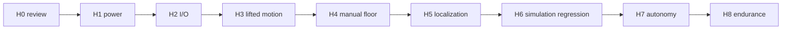

# Test and acceptance plan

Testing is staged so failure occurs with the least available energy. Never skip directly to autonomous motion because software unit tests or simulation pass.

## Evidence rules

Every result records:

- test ID/revision and pass criterion;
- robot ID/hardware revision;
- repository commit, firmware build, ROS/OS/driver versions and parameter checksums;
- equipment IDs/calibration status and environmental conditions;
- initial safety state and authorized test limits;
- command, stimulus and raw observation;
- logs/bags/plots/photos/video/instrument captures;
- pass/fail, anomalies, reviewer and date.

`PASS WITH NOTES` is not a waiver for a failed safety requirement. File defects and repeat after correction.

## Automated software checks

### Protocol and tools

```bash
python3 -m unittest discover -s tools/tests -v
python3 tools/robot_doctor.py
```

Cover golden CRC vectors, every schema boundary, signed numeric bounds, overlength/noise recovery, sequence wrap, fragmented/coalesced reads, stale telemetry, `BOOT` reset and fuzzed invalid input.

### Firmware build

```bash
pio run -d firmware/wildebeest_base
```

Warnings that can affect integer range, signedness, ISR sharing, timing, truncation or buffer capacity are release blockers. A successful compile does not validate pins or control behavior.

### ROS 2

```bash
./scripts/build.sh ros2
cd ros2_ws
colcon test --event-handlers console_direct+
colcon test-result --verbose
```

### ROS 1

```bash
./scripts/build.sh ros1
cd ros1_ws
catkin_make run_tests
catkin_test_results
```

CI should run clean builds, lint/static checks, protocol cross-implementation vectors, URDF/Xacro validation and launch smoke tests on declared OS/ROS profiles. Hardware-in-the-loop remains separately reported.

## Acceptance stages



If a change affects an earlier stage, repeat that stage and everything downstream it can invalidate.

### H0 — design and documentation review

Pass when:

- exact parts/datasheets and as-built wiring/mechanics are recorded;
- safety-critical TBDs have resolved values, rationale and owner;
- power budget, fuse/wire/connector/regulator/battery analyses are reviewed;
- hard E-stop main and auxiliary contact design is reviewed;
- calibrated/test limits and controlled environment are declared;
- recovery and emergency procedures are available at the test site.

### H1 — unpowered and rail validation

Motor power remains disconnected. Pass when:

- continuity/polarity/isolation and connector keying match the schematic;
- no unexpected short or power-state backfeed exists;
- each rail starts on a current-limited source and remains within its documented tolerance under load/transient;
- A1 reads `LOW` when the NC auxiliary loop is healthy and `HIGH` when pressed, unplugged, or wire-open;
- the main E-stop contact independently opens the motor branch;
- no unexpected heating/current occurs.

### H2 — firmware and sensor bench

Motor branch remains open. Pass when:

- firmware boots with watchdog set and outputs disabled;
- correct `BOOT` protocol version is observed;
- CRC/schema/range rejection and resynchronization pass;
- command loss is detected at the configured 300 ms bound;
- hand-turned encoder count/sign/repeatability and max edge-rate margin pass;
- IMU axes/rate, sonar timeout/range and calibrated battery ADC are plausible;
- MCU reset/reconnect cannot reuse stale host state;
- telemetry rate, jitter and errors meet recorded criteria under full sensor load.

### H3 — lifted-wheel motion

Use a stable stand, current-limited motor source, hard E-stop observer and initial low PWM/speed limits. Pass when:

- no motion occurs on boot, connect, launch, reset, clear-stop or zero command;
- each side's motor direction and encoder sign match the matrix;
- all four wheels track low step/ramp commands; each same-side pair agrees without unstable oscillation;
- software stop, hard stop, USB pull and process kill stop output as required;
- pressed/unplugged/broken auxiliary sense states inhibit motion;
- driver/regulator/motor/compute current, voltage and temperature stay inside approved bounds;
- diagnostics identify injected encoder/IMU/range/protocol faults.

### H4 — supervised low-speed floor motion

Use an exclusion zone and physical barriers. Pass when:

- straight/reverse/pivot/arc motion matches odometry sign and command convention;
- stopping distance is measured for authorized load/surface/battery states and within the approved criterion;
- wheel radius/separation calibration meets repeatability criteria;
- dead-man/command timeout, software stop and hard stop work on the floor;
- no tipping, wheel unloading, diagonal rocking, cable contact, fastener movement or thermal issue occurs;
- post-run mechanical and battery inspection passes.

### H5 — sensing and localization

Pass when:

- TF graph is connected with unique owners and measured extrinsics;
- each sensor rate, timestamp age, frame, covariance, range/quality and disconnect behavior meets its criterion;
- encoder/IMU local odometry is validated on known trajectories;
- LiDAR map scale/alignment and loop closure are credible;
- GNSS, if used, passes outdoor quality/multipath and heading-strategy tests;
- estimator innovations/drift are reviewed, not just visually pleasing;
- stale/degraded sensor injection causes the required safe behavior.

### H6 — simulation and replay regression

Pass all applicable scenarios in [simulation](software/simulation.md), including command loss, obstacle, stale scan, reset and localization anomaly. Compare ROS 1/ROS 2 interface behavior. List any physics/sensor simplifications.

### H7 — supervised autonomous mission

Begin with one short, low-speed goal in a controlled mapped area. Pass when:

- preflight and manual checkout pass immediately beforehand;
- planner/controller honor final footprint and motion limits;
- static and appearing obstacle cases meet declared clearance/stop requirements;
- localization stays inside the declared error envelope;
- observer can stop the robot throughout;
- no uncommanded recovery crosses barriers or exclusion boundaries;
- repeated trials meet the predefined success criterion without ignored faults.

### H8 — endurance, thermal and maintenance baseline

Define duration/duty cycle from the mission and component ratings (`TBD` until H0). Exercise worst approved compute, sensor, motor, payload, surface and ambient conditions. Pass when rails, current, temperatures, message age, CPU/memory/storage, CRC/watchdog/reset counts, localization and mechanical retention remain within declared limits. Inspect immediately after the run and again after cooldown.

## Core fault-injection matrix

| Fault | Safe expected result | Stage |
|---|---|---|
| No valid `CMD` for 300 ms | MCU motor output disabled; watchdog diagnostic | H2/H3/H4 |
| USB unplugged | Same stop; host reports disconnected/stale | H3/H4 |
| Base bridge killed | MCU stop; restart remains stopped until deliberate command | H3/H4 |
| Bad CRC/out-of-range command | Ignored, diagnosed, watchdog not refreshed | H2/H3 |
| Arduino reset mid-run | Outputs safe; host detects `BOOT`; no tick jump actuation | H3/H4 |
| Hard E-stop pressed | Main motor energy interrupted; status asserted | H1/H3/H4 |
| E-stop sense cable unplug/open | Status asserted and firmware inhibits motion | H1/H3 |
| Encoder stuck/reversed/intermittent | Autonomous motion blocked; diagnostic/fault visible | H3/H5 |
| LiDAR/IMU/GNSS stream stale | Dependent behavior stops/degrades explicitly | H5/H7 |
| Duplicate `/cmd_vel` or TF owner | Preflight/test fails; no autonomous release | H5/H6 |
| Compute rail transient | No reset within approved load; otherwise redesign | H1/H8 |
| Disk full/log overload | Control remains safe; logging fault reported/mission aborted | H6/H8 |

## Quantitative criteria worksheet

Set these before the relevant test. Values must come from safety/mission needs and measured hardware capability.

| Metric | Criterion | Measurement method | Result |
|---|---|---|---|
| Hard-stop electrical interruption time | `TBD` | scope across motor rail/enable | |
| Watchdog command-to-output disable | 300 ms timeout plus documented processing/output delay | logic analyzer/scope + serial log | |
| Maximum stopping distance | `TBD` by surface/load/speed | marked course + synchronized video | |
| Wheel speed steady-state error/overshoot | `TBD` | encoder/reference plot | |
| Straight/path/yaw odometry error | `TBD` by distance/course | independent ground truth | |
| Sensor rate/jitter/maximum age | `TBD` each | ROS statistics/timestamp analysis | |
| Localization error and recovery time | `TBD` | independent ground truth | |
| Obstacle clearance/reaction distance | `TBD` | instrumented scenarios | |
| Rail droop/ripple/transient | `TBD` from device specs | oscilloscope at load connector | |
| Component/ambient temperature | `TBD` | logged sensors/thermal instrument | |
| Endurance duration/duty cycle | `TBD` | mission log | |

## Test report template

```text
Test ID / revision:
Requirement(s):
Robot / hardware revision:
Commit / firmware build / configuration checksum:
OS / ROS / drivers:
Date, location, personnel:
Environment / surface / payload / battery state:
Test equipment:
Initial state and safety controls:
Procedure and injected fault:
Expected result and numeric criterion:
Observed result and measurement uncertainty:
Artifact links:
PASS / FAIL:
Anomalies / corrective action / retest ID:
Reviewer:
```

Release notes must state the highest physical stage actually passed. Never turn “not run” into “pass” because a subsystem was absent.
