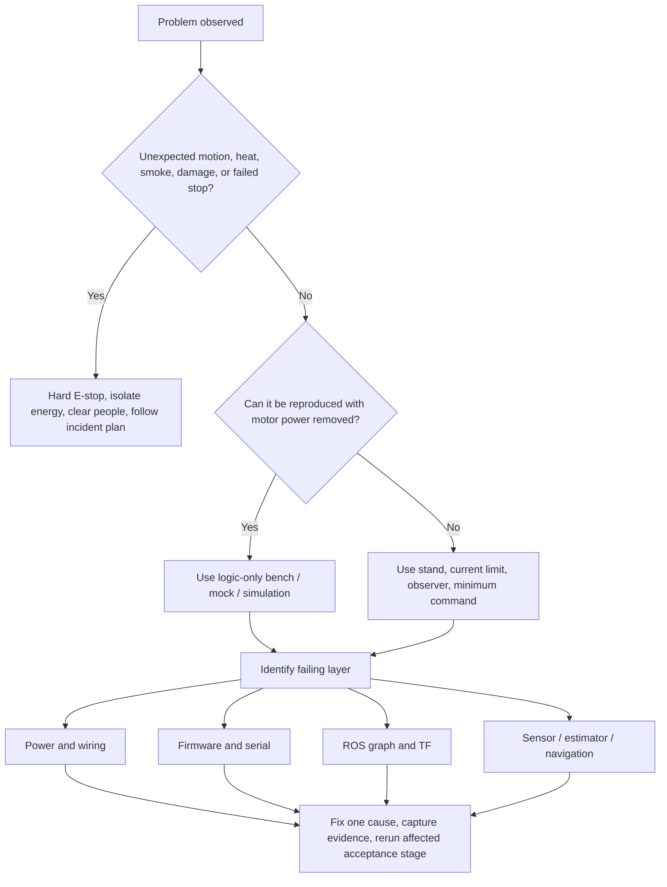

# Troubleshooting

Troubleshoot from the lowest safe layer upward. If motion, heat, odor, current, battery condition, polarity, or E-stop behavior is unexpected, press the hard E-stop, open the service disconnect, and diagnose unpowered. Software output is never sufficient evidence that an energized mechanism is safe to approach.

## First response tree



Do not change multiple signs, gains, frames, drivers and power wiring at once. Preserve the failing log and configuration before the change.

## Minimum diagnostic bundle

Collect these without secrets or unrelated personal data:

```bash
git rev-parse HEAD
cat /etc/os-release
uname -a
test -r /etc/nv_tegra_release && cat /etc/nv_tegra_release
python3 tools/robot_doctor.py
ls -l /dev/serial/by-id/
```

Then add the relevant ROS output:

=== "ROS 2"

    ```bash
    printenv | grep -E 'ROS|RMW|AMENT|COLCON'
    ros2 doctor --report
    ros2 node list
    ros2 topic list -t
    ros2 topic echo /diagnostics --once
    ```

=== "ROS 1"

    ```bash
    printenv | grep -E 'ROS|CATKIN'
    roswtf
    rosnode list
    rostopic list -v
    rostopic echo -n 1 /diagnostics
    ```

If the directory is not a Git checkout, record the source archive name/checksum instead of a commit.

## Power and reset problems

| Symptom | Likely causes | Safe checks | Corrective direction |
|---|---|---|---|
| Nothing powers | Open fuse/disconnect, connector/polarity, regulator not enabled | Battery absent first: continuity; then current-limited rail measurement | Restore reviewed power path; never bypass protection |
| Jetson resets when motors start | Rail droop, shared high-current return, regulator transient/thermal limit, EMI | Wheels lifted; scope at Jetson connector, log current, test logic from separate bench source | Redesign distribution/regulation/grounding, suppress motor noise, validate margin |
| USB disconnects under PWM | Ground shift, cable/connector, EMI, host power management | Motor branch off versus on comparison; inspect kernel log; scope ground/rail | Reroute/shorten/secure cable, correct returns/shielding, address source—not retries alone |
| Fuse opens | Short, stall, undersized protection relative to normal load, failed driver | Isolate branches; resistance/controlled current tests; inspect motor/driver | Fix cause and re-run power analysis; never fit a larger fuse without design review |
| L298N/regulator hot | Excess current/voltage drop, poor airflow, overload, high switching duty | Stop; measure current/temperature within controlled plan | Reduce load only within requirements or replace/redesign with suitable device |
| Battery reading wrong | Unsafe/wrong divider, ADC reference/tolerance, missing common reference, saturation | Disconnect pack; inspect divider; inject known safe voltages; compare calibrated meter | Correct hardware and scaling; keep low-voltage stop disabled until validated |

Never probe a loose energized robot. Secure it, use insulated/appropriate probes, and plan where hands will be before applying energy.

## Arduino does not appear

1. Keep motor power disconnected.
2. Confirm the USB cable supports data and try a known-good port/cable.
3. Inspect `dmesg --follow` or the platform's device log during reconnect.
4. List `/dev/serial/by-id/` and compare USB attributes with the udev rule.
5. Check group membership and session refresh; do not solve access by running ROS as root.
6. Close PlatformIO monitor, Arduino IDE, ModemManager interaction, or another bridge that may hold the port.
7. Confirm baud 115200 and that only one process opens the device.

If the port repeatedly disappears under motor load, return to power/EMI diagnosis.

## Serial connects but diagnostics stay stale

| Observation | Interpretation/action |
|---|---|
| No `BOOT` after MCU reset | Wrong device/baud, firmware absent, TX path blocked; inspect raw serial with motors unpowered |
| `BOOT` seen but protocol version rejected | Firmware/bridge drift; rebuild matching commit, do not bypass version check |
| CRC error count rises | Noise, competing reader/writer, baud mismatch, implementation drift; compare golden vectors and raw bytes |
| `ERR ... RANGE` | Host command exceeds firmware ±450 mm/s or ±1800 mrad/s, or field invalid |
| `ERR ... SCHEMA` | Malformed software-stop frame |
| `ERR ... TYPE` | Incompatible message type/version |
| Sequence gaps | Dropped/corrupt data or expected interleaving; remember ODOM/IMU/RANGE share telemetry sequence |
| Watchdog always set | No valid in-range `CMD` within 300 ms; inspect command ownership, rate, CRC and E-stop state |
| Hard-stop always asserted | NC A1 auxiliary loop open/high, E-stop pressed, broken/unplugged wire, wrong contact/wiring |
| Hard-stop never asserts on wire break | Unsafe sense wiring/firmware mismatch; stop testing until fail-safe behavior is restored |

Use the reference codec/tests to distinguish framing from ROS:

```bash
python3 -m unittest discover -s tools/tests -v
python3 tools/mock_mcu.py --demo --seconds 2
```

## No motion

With wheels lifted and an observer at the hard stop, check in order:

1. Is motor power present at the driver input and absent/present as the hard E-stop changes?
2. Does A1 report healthy only when the NC auxiliary loop is intact?
3. Are watchdog, software-stop, hard-stop or optional low-voltage blocking flags set?
4. Is `/cmd_vel` owned by the intended multiplexer and updating faster than the watchdog?
5. Is the command inside both ROS and firmware limits?
6. Are L298N ENA/ENB jumpers and logic-supply mode correct for the actual board?
7. Do PWM/direction pins change at the Arduino and driver input?
8. Are motor outputs and motor winding continuous?
9. Is target ramp/PWM deadband/closed-loop tuning preventing initial motion?

Do not clear a hard stop or inflate gains to hide a wiring/configuration fault.

## Motion direction or odometry is wrong

Use the [calibration sign matrix](calibration.md#1-direction-and-sign-matrix). Test one wheel at a time.

| Symptom | Most probable issue |
|---|---|
| Wheel moves forward, ticks decrease | Encoder A/B phase or encoder inversion for that side |
| Ticks increase by hand forward, motor drives backward | Motor leads/direction inversion for that side |
| Robot drives backward for positive `linear.x` | Both motor conventions wrong or body command sign changed |
| Positive `angular.z` turns clockwise | Left/right mapping or angular convention wrong |
| RViz wheels/robot move opposite physical convention | URDF joint axis or ROS bridge sign; do not change calibrated firmware blindly |
| Odom arcs during straight travel | Radius mismatch, missed counts, drag/load asymmetry, slip, loose wheel |

Choose one canonical correction layer and document it. Re-run all direction, straight, pivot and watchdog tests.

## Speed oscillation, noise or poor low-speed control

- Verify counts/revolution definition and control-loop `dt` first.
- Plot target, measured wheel speed, PWM, battery voltage and flags.
- Check encoder edge quality and missed/noisy counts with motors off/on.
- Characterize deadband/feedforward before increasing integral gain.
- Look for saturation, integral wind-up, loose coupling, gearbox backlash and wheel lift.
- Ensure the L298N can supply the required loaded voltage/current without thermal limiting.
- Tune one controlled variable at a time and preserve before/after logs.

An Arduino Uno with low-resolution encoders may not support smooth very-low-speed control. That is a hardware/control-bandwidth limit, not necessarily a PID defect.

## IMU problems

| Symptom | Check |
|---|---|
| No IMU frames and error flag | MPU enabled, address, supply, SDA/SCL continuity, pull-up voltage, initialization |
| Axes/sign wrong | Breakout-to-`imu_link` transform and physical orientation |
| Acceleration/gyro spikes with motors | Mount vibration, motor EMI, ground/power noise, I²C integrity |
| Yaw drifts while still | Expected gyro integration drift; MPU6050 has no magnetometer; estimate bias and do not claim absolute heading |
| Filter diverges | Units, timestamps, frame, gravity removal, duplicated correlated inputs, covariance too small |

Do not publish an invented orientation to satisfy an estimator input.

## Ultrasonic problems

- A timeout means unknown/no echo, not maximum clear range.
- Check trigger with a logic analyzer and echo only within safe electrical levels.
- Test a large hard perpendicular target before soft/angled/narrow targets.
- Inspect mount obstruction and motor acoustic/electrical interference.
- With multiple sensors, trigger sequentially and identify crosstalk experimentally.
- Age out old ROS messages when the firmware omits a timed-out sample.

## LiDAR problems

| Symptom | Check |
|---|---|
| Device absent | Exact USB/serial identity, supply/current, cable, permission, vendor driver |
| Scan mirrored/reversed | Driver angle ordering and `lidar_link` orientation |
| Map scale wrong | LiDAR range units, wheel geometry/odometry scale, time synchronization |
| Chassis visible | Physical placement, measured transform, narrowly justified mask |
| Dropouts under load | Power/USB bandwidth/EMI/thermal and driver logs |
| RViz shows scan but navigation ignores it | Frame connectivity, timestamp age, QoS (ROS 2), costmap topic/source configuration |

## IMX219 camera problems

Power the Jetson off before touching the CSI ribbon. Verify contact orientation, connector latch, camera/carrier compatibility and NVIDIA Argus/V4L pipeline outside ROS first. A generic UVC driver is not automatically suitable for a CSI IMX219.

If ROS 2 runs on a workstation while the Nano owns CSI, validate the chosen image transport for resolution, encoding, latency, jitter, drops, clock alignment, CPU/GPU use and privacy. Lowering resolution may hide bandwidth symptoms but changes camera calibration.

## GNSS problems

- Test outside with clear sky; indoors is not a valid acquisition benchmark.
- Confirm UART voltage, crossed RX/TX, baud, antenna and NMEA stream before ROS.
- Preserve `NavSatStatus`; do not convert no-fix to `(0,0)`.
- Inspect covariance/quality and stationary scatter.
- Multipath near buildings/vehicles/trees can create plausible but wrong positions.
- Position fixes do not provide trustworthy stationary yaw; verify heading strategy.
- Verify local projection/datum and metres-versus-degrees handling before fusion.

## TF and visualization problems

=== "ROS 2"

    ```bash
    ros2 run tf2_tools view_frames
    ros2 run tf2_ros tf2_echo map base_link
    ros2 topic info /tf --verbose
    ros2 topic info /joint_states --verbose
    ```

=== "ROS 1"

    ```bash
    rosrun tf2_tools view_frames.py
    rosrun tf tf_echo map base_link
    rostopic info /tf
    rostopic info /joint_states
    ```

Diagnose the first missing/duplicated edge, not the final RViz error. Common causes are mixed simulated/wall time, future/old sensor stamps, duplicate `odom -> base_link`, missing static sensor transform, inconsistent leading namespace/frame prefix, and two joint-state publishers.

## Navigation does not move or is unsafe

Do not bypass safety gates to make the planner move. Check:

- localization and transform age;
- `/scan` content/frame/age and costmap source;
- footprint and inflation against measured robot envelope;
- map scale/origin and initial pose;
- command multiplexer priority/timeouts;
- firmware hard/software/watchdog flags;
- velocity/acceleration limits and controller progress tolerances;
- local/global plan and recovery behavior;
- unknown/free/clearing semantics around missing sensor data.

If navigation moves toward an obstacle, hard-stop first, then reproduce in simulation or bag replay with actuation isolated.

## Escalation information

A useful issue contains the smallest safe reproduction, expected/actual behavior, exact versions/configuration, diagnostics, relevant raw protocol or bag slice, and acceptance stage. Redact secrets, faces, precise private locations and unrelated network information. State explicitly whether motor power was connected and whether any safety function failed.
